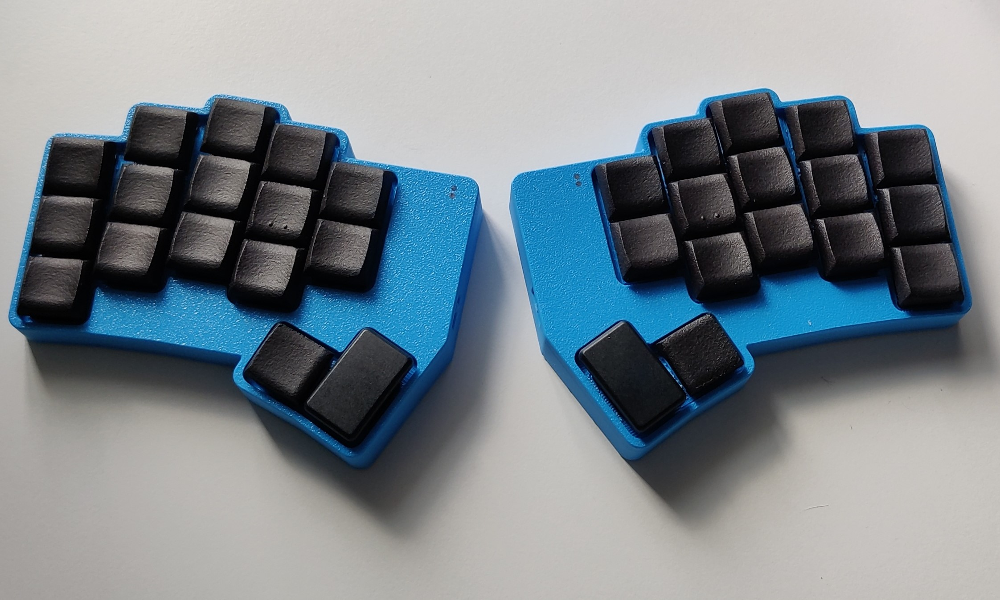

# NostrumX
A 32 key ergonomic split keyboard using Seeed Xiao BLE

This keyboard is a variation on my original [Nostrum](https://github.com/bennytrouser/nostrum) but modified to use the Seeeduino Xiao BLE with the battery mounted under the PCB into the case. Not designed to be used without the case.

- 3° Splay on pinky and ring columns
- Created with the [ergogen](https://github.com/ergogen/ergogen) and KiCad8. Case files created with Autodesk Fusion360.
- Firmware using ZMK, including the RGB Widget module from [Caksoylar](https://github.com/caksoylar/zmk-rgbled-widget)
- Choc V1 switch compatible (hotswap or soldered). Hotswap recomennded as the switch plate is integrated into the case.
- Custom mildly tented case including switch sliders.
- MCU not socketed, SMD soldered only.
- Inspiration from the [Hummingbird](https://github.com/PJE66/hummingbird) style [Berylline](https://github.com/jcmkk3/trochilidae#berylline) by [jcmkk3](https://github.com/jcmkk3)

## PCB

## Parts
The case is designed to be fastened from the underside using M1.5x6mm self tapping screws. Feet used are 10x3x1.5mm and 14x3x1.5mm. Left side has space to fit a lipo Battery 402030(180mah). Due to constraints, the right side will need a narrower battery if using hotswap. For my build, I used a 401322 (120mah) but a different size may fit. Example parts listed below. Source your switches and sockets and MCUs where available.

| Part  | Link |
| ------------- | ------------- |
| Battery 402030 | https://www.ebay.co.uk/itm/355875616696 |
| Battery 401322 | https://www.ebay.co.uk/itm/195234785175 |
| Self tapping Screws M1.5x6mm | https://www.aliexpress.com/item/1005005469153402.html |
| SMD diodes SOD-123 1N4148W T4 | https://www.aliexpress.com/item/32948518338.html |
| 1.5mm Fibreoptic cable (for led shinethrough) | https://www.aliexpress.com/item/1005005886250822.html |
| Reset button TL3342 | https://www.aliexpress.com/item/1005007506687094.html |
| Feet | https://www.aliexpress.com/item/1005006691343859.html |
